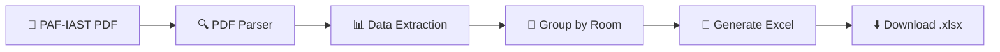

<p align="center">
  
</p>

<h1 align="center">⏱️ Timely</h1>

<p align="center">
  <strong>PAF-IAST Timetable PDF → Excel Converter</strong><br>
  <sub>Upload. Convert. Download. It's that simple.</sub>
</p>

<p align="center">
  <a href="#-features"></a>
  <a href="#-quick-start"></a>
  <a href="#-tech-stack"></a>
  <a href="#-contributing"></a>
</p>

<p align="center">
  
  
  
  
</p>

---

## 🎯 What is Timely?

**Timely** is an open-source web tool built **specifically for PAF-IAST** (Pak-Austria Fachhochschule Institute of Applied Sciences & Technology) that converts timetable PDFs into clean, room-organized Excel spreadsheets.

> No sign-up. No API keys. No BS — just upload and download.

### The Problem

PAF-IAST publishes class timetables as PDFs — great for viewing, terrible for organizing. Faculty and students often need the data in a structured format for planning, room allocation, or schedule management.

### The Solution

Upload the PDF → Timely extracts every room, day, time slot, and class → Download a perfectly formatted `.xlsx` file with each room on its own sheet.

---

## ✨ Features

| Feature | Description |
|---------|-------------|
| 📄 **Smart PDF Parsing** | Reads PAF-IAST timetable PDFs and extracts slots, rooms, days, and class info accurately |
| 🏫 **Room-Organized Output** | Groups by room (A1-109, C1-B05, Labs, etc.) — each room gets its own Excel sheet |
| ⚡ **Instant Processing** | Upload to download in under 10 seconds |
| 📊 **Live Data Preview** | Preview extracted data in a spreadsheet-style table before downloading |
| 🔒 **Private & Secure** | Files are processed in-memory and never stored permanently |
| 🎨 **Modern Web UI** | Clean, responsive SaaS-style interface with drag-and-drop upload |

---

## 🚀 Quick Start

### Prerequisites

- **Python 3.8+**
- **pip** (Python package manager)

### Installation

```bash
# 1. Clone the repository
git clone https://github.com/ahsan719/pafiast_timetable_pdf_to_excel_converter.git
cd pafiast_timetable_pdf_to_excel_converter

# 2. Create a virtual environment (recommended)
python -m venv venv
source venv/bin/activate        # macOS/Linux
venv\Scripts\activate           # Windows

# 3. Install dependencies
pip install -r requirements.txt

# 4. Run the application
cd web_app
python app.py
```

### Usage

1. Open your browser at **`http://127.0.0.1:5000`**
2. Drag & drop your PAF-IAST timetable PDF (or click Browse)
3. Wait a few seconds for processing
4. Click **Download Excel Report**
5. *(Optional)* Click **View Data Preview** to inspect the extracted data

---

## 🏗️ Project Structure

```
pafiast_timetable_pdf_to_excel_converter/
│
├── web_app/
│   ├── app.py                    # Flask application & routes
│   └── utils/
│       └── timetable_processor.py # PDF parsing & Excel generation
│
├── templates/
│   └── index.html                # Frontend HTML template
│
├── static/
│   ├── style.css                 # Stylesheet (SaaS light theme)
│   └── script.js                 # Frontend logic & interactions
│
├── main.py                       # CLI version (standalone)
├── requirements.txt              # Python dependencies
└── README.md
```

---

## 🛠️ Tech Stack

<table>
  <tr>
    <td align="center"><strong>Backend</strong></td>
    <td>
      
      
    </td>
  </tr>
  <tr>
    <td align="center"><strong>PDF Processing</strong></td>
    <td>
      
      
    </td>
  </tr>
  <tr>
    <td align="center"><strong>Excel Generation</strong></td>
    <td>
      
    </td>
  </tr>
  <tr>
    <td align="center"><strong>Frontend</strong></td>
    <td>
      
      
      
    </td>
  </tr>
  <tr>
    <td align="center"><strong>Icons</strong></td>
    <td>
      
    </td>
  </tr>
</table>

---

## 📋 How It Works



1. **Upload** — User uploads a PAF-IAST timetable PDF via the web interface
2. **Parse** — `pdfplumber` extracts table data from each page
3. **Extract** — Regex identifies rooms, days, time slots (1–16), and class info
4. **Organize** — Data is grouped by room name
5. **Generate** — `openpyxl` creates a formatted Excel file with merged headers, colors, and one sheet per room
6. **Download** — User gets the `.xlsx` file instantly

---

## 📦 Output Format

The generated Excel file includes:

- **One sheet per room** (e.g., `A1-109`, `C1-B05`, `Bio Lab`)
- **Formatted headers** with room name and color coding
- **Columns**: Day, Start Time, End Time, Class Info, Section
- **Merged cells** and professional styling

---

## 🤝 Contributing

Contributions are welcome! Here's how you can help:

1. **Fork** the repository
2. **Create** a feature branch (`git checkout -b feature/amazing-feature`)
3. **Commit** your changes (`git commit -m 'Add amazing feature'`)
4. **Push** to the branch (`git push origin feature/amazing-feature`)
5. **Open** a Pull Request

### Ideas for Contribution

- [ ] Support for multiple timetable formats (other universities)
- [ ] Batch processing (multiple PDFs at once)
- [ ] Teacher-view timetable generation
- [ ] Dark mode toggle
- [ ] Docker support for easy deployment

---

## 📄 License

This project is open source and available under the [MIT License](LICENSE).

---

## 👨‍💻 Author

Built with ❤️ at **PAF-IAST** by [Ahsan](https://github.com/ahsan719)

---

<p align="center">
  <sub>If this tool saved you time, consider giving it a ⭐ on GitHub!</sub>
</p>
